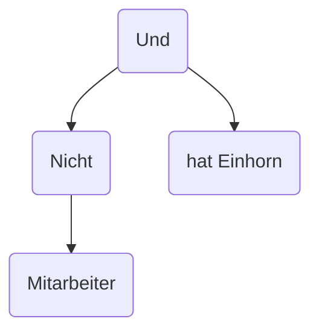

# Eine erste Regel
In diesem Kapitel soll es darum gehen, unsere erste eigene einfache Regel zu schreiben.
Das Beispiel dafür soll folgende Regel sein:
!!! example "Beispiel" 
    Die Person deren Daten übergeben wurden, darf kein Mitarbeiter sein und muss ein Einhorn haben.
## Von natürlicher Sprache zur Logik
Der erste Schritt ist, sich klarzumachen, was eigentlich die Anforderungen der Regel sind, und wie diese zusammenhängen. 

Unsere Regel besteht aus zwei Teilen, die durch ein "und" miteinander verbunden sind. Diese sind "hat ein Einhorn" und "ist nicht Mitarbeiter". Letzteres lässt sich auch wieder zerlegen, nämlich in "nicht" und "ist Mitarbeiter". Dieses hierarchische Zerlegen lässt sich gut als Baum visualisieren:


## Unsere Regel in Rita
### Einleitung
Nachdem wir verstanden haben, was unsere Regel eigentlich sagt, können wir nun beginnen, sie tatsächlich im Rita Format aufzuschreiben. 

Rita Regeln werden im JSON Format geschrieben. Deshalb muss zunächst eine JSON Datei erstellt werden. Es gibt ein JSON Schema, das beschreibt und überprüft, wie Regeln geschrieben werden sollen. Auch wenn es optional ist, empfiehlt es sich, dieses in der Datei anzugeben, da dann Code Editoren wie zum Beispiel VS Code oder die JetBrains IDEs Autovervollständigung anbieten und Fehler bemängeln.

Rita ist so angelegt, dass eine wie die eben angelegte Datei stets ein sogenanntes Ruleset enthält, also nicht nur eine Regel, sondern eine Menge von Regeln. Zu Beginn sieht unsere Datei also so aus:
```json
{
  "$schema": "https://raw.githubusercontent.com/educorvi/rita/main/rita-core/src/schema/schema.json",
  "rules": []
}
```
In Zeile 1 steht die bereits erwähnte Angabe des JSON Schemas, in Zeile 2 steht ein (noch leeres) Array von Regeln, in das wir nun unsere Regel schreiben wollen.

### Die Regel
Zunächst ergänzen wir das `rules` Array um ein JSON Objekt, dass unsere Regel beschreibt

```json
{
  "$schema": "https://raw.githubusercontent.com/educorvi/rita/main/rita-core/src/schema/schema.json",
  "rules": [
    {
      "id": "example1",
      "rule": {...}
    }
  ]
}
```
Die Regel muss eine im Ruleset eindeutige ID enthalten und eine Formel, die die Regel beschreibt. Für diese Formel gibt es mehrere Optionen, die für den Anfang interessanten sind `and`, `or`, `not` und `atom`.

`and`, `or` und `not` tun das, was man intuitiv vermuten würde: Sie nehmen jeweils wieder Formeln als Argumente und entsprechen in ihrer Funktion dem logischen und, oder & nicht.

`atom` ist dafür da, Informationen aus den übergebenen Daten auszulesen, indem man den Pfad der gewünschten Information in den Daten angibt. Bekommen wir bei der Auswertung der Regel zum Beispiel folgendes Datenobjekt übergeben...

```json
{
  "info1": false,
  "info2": {
    "test": true
  }
}
```
...könnten wir mit dem Pfad `info1` den Wert von info1 (`false`), mit dem Pfad `info2.test` den Wert von test (`true`) abrufen.

### Anwendung
Wenden wir das Gelernte nun also an und setzen unsere Regel als Rita Regel um. Zur Erinnerung:
> Die Person deren Daten übergeben wurden, darf kein Mitarbeiter sein und muss ein Einhorn haben.  


Wir gehen davon aus, dass wir die Daten in folgendem Format übergeben bekommen:
```json
{
    "hatEinhorn": true/false,
    "mitarbeiter": true/false
}
```
Da wir auf der obersten Ebene ein "Und" haben, beginnen wir mit einem `and`

```json
{
  "$schema": "https://raw.githubusercontent.com/educorvi/rita/main/rita-core/src/schema/schema.json",
  "rules": [
    {
      "id": "example1",
      "rule": {
        "type": "and",
        "arguments": [
          //hat Einhorn,
          //nicht Mitarbeiter
        ]
      }
    }
  ]
}
```
Das Argument "Hat Einhorn" können wir nun mit einem Atom aus den Daten auslesen:
```json
{
  "$schema": "https://raw.githubusercontent.com/educorvi/rita/main/rita-core/src/schema/schema.json",
  "rules": [
    {
      "id": "example1",
      "rule": {
        "type": "and",
        "arguments": [
          {
            "type": "atom",
            "path": "hatEinhorn"
          }
          //nicht Mitarbeiter
        ]
      }
    }
  ]
}
```
"Mitarbeiter" können wir auch auslesen und müssen es dann nur noch mit `not` negieren:

```json
{
  "$schema": "https://raw.githubusercontent.com/educorvi/rita/main/rita-core/src/schema/schema.json",
  "rules": [
    {
      "id": "example1",
      "rule": {
        "type": "and",
        "arguments": [
          {
            "type": "atom",
            "path": "hatEinhorn"
          },
          {
            "type": "not",
            "arguments": [
              {
                "type": "atom",
                "path": "mitarbeiter"
              }
            ]
          }
        ]
      }
    }
  ]
}
```
:material-party-popper: Das erste Ruleset ist geschrieben! Im nächsten Kapitel werden wir einen Webserver installieren, auf dem man dieses Ruleset speichern und Daten dagegen auswerten können. In den späteren Kapiteln wird es dann um komplexere Regeln gehen, zum Beispiel mit Vergleichen oder Berechnungen.
