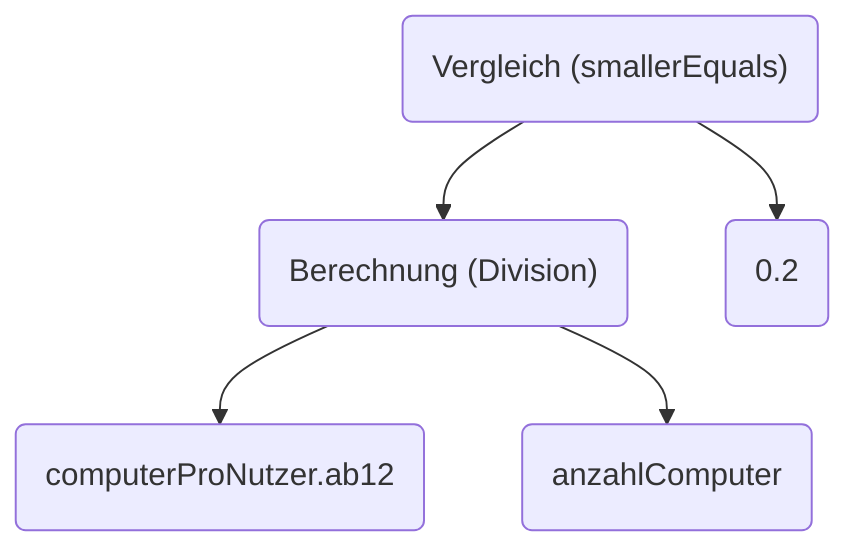

# Berechnungen
In einem Ruleset können auch Berechnungen ausgeführt werden. Diese Berechnungen können jedoch nicht die Wurzel einer Regel sein, da Regeln ja stets zu wahr oder falsch ausgewertet können. Das bedeutet, dass Berechnungen stets innerhalb eines Vergleiches sein müssen. "`Preis ohne Steuer`" ist zum Beispiel keine gültige Regel, "`Preis ohne Steuer ist kleiner als 10`" hingegen schon.

## Berechnungen mit Zahlen
Angenommen, wir wollen überprüfen, dass der Nutzer `ab12` nicht mehr als 20% aller Computer im Büro besitzt und wir bekommen durch die Daten sowohl die Anzahl aller Computer im Büro, als auch die Anzahl der Computer pro Nutzer in folgender Form:
```json
{
    "anzahlComputer": 10,
    "computerProNutzer": {
        "ab12": 2,
        "xy": 5,
        "dd": 2,
        "albert": 1
    }
}
```
Als Graph dargestellt baut sich die Regel wie folgt auf:

Um den Prozentsatz zu bekommen, teilen wir zunächst die Zahl der Computer des Nutzers durch die Zahl aller Computer und vergleichen das dann mit der Option "kleiner Gleich" mit der Zahl 0.2 (=20%).

In einer Rita Regel sieht das aus wie folgt:
```json
{
    "$schema": "https://raw.githubusercontent.com/educorvi/rita/main/rita-core/src/schema/schema.json",
    "rules": [
        {
            "id": "beispiel",
            "rule": {
                "type": "comparison",
                "operation": "smallerOrEqual",
                "arguments": [
                    {
                        "type": "calculation",
                        "operation": "divide",
                        "arguments": [
                            {
                                "type": "atom",
                                "path": "computerProNutzer.ab12"
                            },
                            {
                                "type": "atom",
                                "path": "anzahlComputer"
                            }
                        ]
                    },
                    0.2
                ]
            }
        }
    ]
}
```
Mögliche Operationen sind:

- `add`: Addiert die beiden Argumente
- `subtract`: Subtrahiert das zweite vom ersten Argument
- `multiply`: Multipliziert die beiden Argumente
- `divide`: Teilt das erste durch das zweite Argument
- `modulo`: Berechnet den Rest der Division Argument1/Argument2. (z.B. `mod(11,3)=2`)

## Berechnungen mit Datumsangaben
Rita kann nicht nur mit Zahlen rechnen, sondern auch mit Daten. Ein Datum kann dabei entweder mit oder ohne Uhrzeit vorliegen (`"2022-12-24"` oder `"2022-12-24:08:07.325"`).

### Abstand zwischen zwei Zeitpunkten
Nehmen wir an, wir wollen überprüfen ob ein Nutzer zum Zeitpunkt eines wichtigen Datums jünger als 18 Jahre war und bekommen in den Daten das wichtige Datum und seinen Geburtstag.
```json
{
    "wichtigesDatum": "2022-08-21",
    "geburtstag": "2005-03-18"
}
```
Der Abstand zwischen zwei Zeitpunkten ist in Rita definiert als die Subtraktion des späteren Datums vom früheren, in unserem Fall also `wichtigesDatum - geburtstag`. Das Ergebnis ist dann eine Zahl, die Länge des Intervalls angibt.
Bei der Berechnungen mit Daten gibt es noch zwei wichtige Properties im Berechnungsobjekt in JSON, nämlich `dateResultUnit` und `dateCalculationUnit`. Beide können auf folgende Werte gesetzt werden:

- `seconds`
- `minutes`
- `hours`
- `days`
- `months`
- `years`

!!! warning "Achtung"
    Bei den Einheiten `month` und `year` können unter Umständen durch die Umrechnung Ungenauigkeiten auftreten

`dateResultUnit` gibt an in welcher Einheit das Ergebnis sein soll. Wenn also der Abstand zwischen zwei Daten bestimmt wird, gibt dieser Wert an, ob das Ergebnis in Jahren, Tagen, ... angegeben werden soll.

`dateCalculationUnit` gibt bei bei den weiter unten ausgeführten Berechnungen mit einem Datum und einem Zeitintervall die Einheit des durch eine Zahl angegebenen Zeitintervalls an.

Nun zurück zu unserem Beispiel. Es ergibt sich die folgende Regel:
```json
{
    "$schema": "https://raw.githubusercontent.com/educorvi/rita/main/rita-core/src/schema/schema.json",
    "rules": [
        {
            "id": "beispiel",
            "rule": {
                "type": "comparison",
                "operation": "smaller",
                "arguments": [
                    {
                        "type": "calculation",
                        "operation": "subtract",
                        "dateResultUnit": "years",
                        "arguments": [
                            {
                                "type": "atom",
                                "path": "wichtigesDatum"
                            },
                            {
                                "type": "atom",
                                "path": "geburtstag"
                            }
                        ]
                    },
                    18
                ]
            }
        }
    ]
}
```

### Datumsangaben und Zeitintervallen
Mit `add` und `subtract` können auch Zeitintervalle auf ein Datum addiert, bzw. von einem Datum abgezogen werden. Diese Berechnungen liefern ein Datum als Ergebnis, das Intervall wird durch eine Zahl angeben, deren Einheit mit `dateCalculationUnit` gesetzt werden kann.

Wollen wir zum Beispiel überprüfen, ob der Tag vor dem Geburtstag des Nutzers tatsächlich vor dem Geburtstag liegt (ein Beispiel für eine Regel, die immer wahr wäre), könnten wir das mit folgender Regel tun:
```json
{
    "$schema": "https://raw.githubusercontent.com/educorvi/rita/main/rita-core/src/schema/schema.json",
    "rules": [
        {
            "id": "beispiel",
            "rule": {
                "type": "comparison",
                "operation": "smaller",
                "arguments": [
                    {
                        "type": "calculation",
                        "operation": "subtract",
                        "dateCalculationUnit": "days",
                        "arguments": [
                            {
                                "type": "atom",
                                "path": "geburtstag"
                            },
                            1
                        ]
                    },
                    {
                        "type": "atom",
                        "path": "geburtstag"
                    }
                ]
            }
        }
    ]
}
```